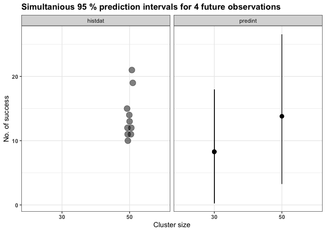

<!-- README.md is generated from README.Rmd. Please edit that file -->

# predint

<!-- badges: start -->
<!-- badges: end -->

In many pharmaceutical and biomedical applications such as assay
validation, assessment of historical control data or the detection of
anti-drug antibodies, prediction intervals are of use. The package
predint provides functions to calculate bootstrap calibrated prediction
intervals (or limits) for one or more future observations based on
overdispersed binomial data, overdispersed poisson data, as well as data
that is modeled by linear random effects models fitted with
lme4::lmer(). The main functions are:

- `beta_bin_pi()` for beta-binomial data (overdispersion differs between
  clusters)

- `quasi_bin_pi()` for quasi-binomial data (constant overdispersion
  between clusters)

- `quasi_pois_pi()` for quasi-Poisson data (constant overdispersion
  between clusters)

- `lmer_pi_futmat()` for data that is modeled by a linear random effects
  model. This function takes the experimental design of the future
  observations into account if computed for
  
  observations.

- `lmer_pi_futvec()` for data that is modeled by a linear random effects
  model. This function takes the experimental design of the future
  observations into account if computed for
  
  observations.

- `lmer_pi_unstruc()` for data that is modeled by a linear random
  effects model. This function is a direct implementation of the
  interval described in Menssen and Schaarschmidt 2022.

For all of these functions, it is assumed that the historical, as well
as the future (or actual) observations descend from the same data
generating process.

## Installation

You can install the released version of predint from
[CRAN](https://CRAN.R-project.org) with:

``` r
install.packages("predint")
```

And the development version from [GitHub](https://github.com/) with:

``` r
# install.packages("devtools")
devtools::install_github("MaxMenssen/predint")
```

## Example

The following example is based on the scenario described in Menssen and
Schaarschmidt 2019: Based on historical control data for the mortality
of male B6C3F1-mice obtained in long term studies at the National
Toxicology Program (NTP 2017), prediction intervals (PI) can be computed
in order to validate the observed mortality of actual (or future)
control groups.

On one hand, a pointwise PI for

future observation can be computed in order to validate the outcome of
one actual (or future) untreated control group.

On the other hand, it might be of interest to validate several control
groups or the whole actual experiment (control and treatment groups). In
such a case, a simultanious prediction interval for

future observations is required.

Similarly to Menssen and Schaarschmidt 2019, it is assumed, that the
data is overdispersed binomial. Hence, the `quasi_bin_pi()` function
will be used in the following two examples.

### Evaluation of one future control group

In this example, the validation of one control group is of interest. For
this purpose, a pointwise 95 % prediction interval for one future
observation is computed based on the historical data. Since the
underlying distribution is skewed, the lower and the upper prediction
limit are calibrated independently from each other (by setting
`algorithm="MS22mod"`).

``` r
# load predint
library(predint)
#> Loading required package: ggplot2
#> Loading required package: lme4
#> Loading required package: Matrix

# Data set 
# see Table 1 of the supplementary material of Menssen and Schaarschmidt 2019
dat_real <- data.frame("dead"=c(15, 10, 12, 12, 13, 11, 19, 11, 14, 21),
                       "alive"=c(35, 40, 38, 38, 37, 39, 31, 39, 36, 29))

# PI for one future control group comprised of 30 mice
pi_m1 <- quasi_bin_pi(histdat=dat_real, 
                      newsize=30,
                      traceplot = FALSE, 
                      alpha=0.05,
                      algorithm="MS22mod")

pi_m1
#> Pointwise 95 % prediction interval for one future observation 
#>  
#>      lower    upper newsize
#> 1 2.176397 15.17107      30
```

The mortality of the actual control group is in line with the historical
knowledge if it is not lower than 2.176 or higher than 2.176.

A grafical overview about the prediction interval can be given with

``` r
plot(pi_m1)
```


### Evaluation of several observations

As noted above, it is sometimes of interest to validate not just an
actual control group, but rather the whole study (e.g. control and
several dosage groups). For this purpose, it was suggested by Kluxen et
al 2021 and Valverde-Garcia et al. 2019 to compare the outcome of all
groups against prediction limits computed based on the historical
control data. Since several future (or actual) observations should be
validated simultaniously, a prediction interval for

future observations has to be computed based on the historical controls.

Please be aware, it is assumed that both, the historical as well as the
future (or actual) observations descent from the same data generating
process. Be aware, that the standard error used for the calculation of
prediction intervals is estimated based on the historical control groups
and hence reflects the variance between these historical controls, which
is not necessarily the variance that occurs inside one future (or
actual) study. E.g. the amount of (over)dispersion might differ between
the actual control vs. their concurrent treatment groups (inside study
dispersion) and the historical control groups (between control
dispersion).

Anyhow, if a prediction interval for several future observations (in
this case, a control group of 50 mice vs. three treatment groups of 30
mice) is needed, their the simultaneous 95 % prediction intervals can be
computed as

``` r
pi_m4 <- quasi_bin_pi(histdat=dat_real,
                      newsize=c(50, 30, 30, 30), 
                      traceplot = FALSE,
                      alpha=0.05,
                      algorithm="MS22mod")
pi_m4
#> Simultanious 95 % prediction intervals for 4 future observations 
#>  
#>       lower    upper newsize
#> 1 3.2578966 26.56130      50
#> 2 0.2639672 17.98347      30
#> 3 0.2639672 17.98347      30
#> 4 0.2639672 17.98347      30
```

In this case, the untreated control group that contains 50 animals is in
line with the historical control data if its mortality falls between
3.258 and 26.561. Similarly, the treatment groups that contain 30
animals are in line with the historical knowledge if their mortality
ranges between 0.264 and 17.983.

A grafical overview about the prediction intervals can be given with

``` r
plot(pi_m4)
```



## References

Menssen, M., Schaarschmidt, F.: Prediction intervals for all of M future
observations based on linear random effects models. Statistica
Neerlandica. 2022. [DOI:
10.1111/stan.12260](https://onlinelibrary.wiley.com/doi/10.1111/stan.12260?af=R)

Menssen M, Schaarschmidt F.: Prediction intervals for overdispersed
binomial data with application to historical controls. Statistics in
Medicine. 2019;38:2652-2663.
[DOI:10.1002/sim.8124](https://onlinelibrary.wiley.com/doi/10.1002/sim.8124)

Kluxen et al.: Using historical control data in bioassays for regulatory
toxicology. Regulatory Toxicology and Pharmacology. 2021;125:105024
[DOI:10.1016/j.yrtph.2021.105024](https://doi.org/10.1016/j.yrtph.2021.105024)

Valverde-Garcia et al.: An avian reproduction study historical control
database: A tool for data interpretation. Regulatory Toxicology and
Pharmacology. 2018;92:295-302
[DOI:10.1016/j.yrtph.2017.12.004](https://doi.org/10.1016/j.yrtph.2017.12.004)

NTP 2017: [Tables of historical controls: pathology tables by
route/vehicle.](https://ntp.niehs.nih.gov/results/dbsearch/historical/index.html),
Accessed May 17, 2017.
