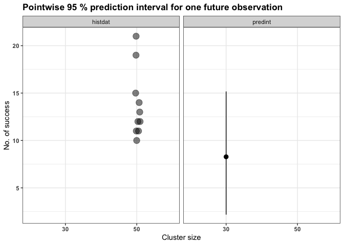

<!-- README.md is generated from README.Rmd. Please edit that file -->

# predint

<!-- badges: start -->

[](https://CRAN.R-project.org/package=predint)

[](https://CRAN.R-project.org/package=predint)
<!-- badges: end -->

In many pharmaceutical and biomedical applications such as assay
validation, assessment of historical control data or the detection of
anti-drug antibodies, prediction intervals are of use. The package
predint provides functions to calculate bootstrap calibrated prediction
intervals (or limits) for one or more future observations based on
overdispersed binomial data, overdispersed Poisson data, as well as data
that is modeled by linear random effects models fitted with
lme4::lmer(). The main functions are:

- `beta_bin_pi()` for beta-binomial observations (overdispersion differs
  between clusters)

- `quasi_bin_pi()` for quasi-binomial observations (constant
  overdispersion between clusters)

- `neg_bin_pi()` for negative_binomial observations (overdispersion
  differs between clusters)

- `quasi_pois_pi()` for quasi-Poisson observations (constant
  overdispersion between clusters)

- `lmer_pi_futmat()` for data that is modeled by a linear random effects
  model. This function takes the experimental design of the future
  observations into account if computed for $M>1$ observations.

For all of these functions, it is assumed that the historical, as well
as the future (or current) observations descend from the same data
generating process.

## Installation

You can install the released version of predint from
[CRAN](https://CRAN.R-project.org) with:

``` r
install.packages("predint")
```

And the development version from [GitHub](https://github.com/) with:

``` r
# install.packages("devtools")
devtools::install_github("MaxMenssen/predint")
```

## Example

The following example is based on the scenario described in Menssen and
Schaarschmidt 2019: Based on historical control data for the mortality
of male B6C3F1-mice obtained in long term studies at the National
Toxicology Program (NTP 2017), prediction intervals (PI) can be computed
in order to validate the observed mortality in one concurrent (or
future) control group.

Similarly to Menssen and Schaarschmidt 2019, it is assumed, that the
data is overdispersed binomial. Hence, the `quasi_bin_pi()` function
will be used in the following two examples.

### Evaluation of one future control group

In this example, the validation of one control group the is comprised of
30 mice is of interest. For this purpose, a pointwise 95 % prediction
interval for one future observation is computed based on the historical
data. Since the underlying distribution is skewed, the lower and the
upper prediction limit are calibrated independently from each other (by
setting `algorithm="MS22mod"`).

``` r
# load predint
library(predint)
#> Loading required package: ggplot2
#> Loading required package: lme4
#> Loading required package: Matrix
#> Loading required package: MASS
#> 
#> Attaching package: 'predint'
#> The following object is masked from 'package:stats':
#> 
#>     rnbinom

# Data set 
# see Table 1 of the supplementary material of Menssen and Schaarschmidt 2019
mortality_HCD
#>    dead alive
#> 1    15    35
#> 2    10    40
#> 3    12    38
#> 4    12    38
#> 5    13    37
#> 6    11    39
#> 7    19    31
#> 8    11    39
#> 9    14    36
#> 10   21    29

# PI for one future control group comprised of 30 mice
pi_m1 <- quasi_bin_pi(histdat=mortality_HCD, 
                      newsize=30,
                      traceplot = FALSE, 
                      alpha=0.05,
                      algorithm="MS22mod")

pi_m1
#> Pointwise 95 % prediction interval for one future observation 
#>  
#>      lower    upper newsize
#> 1 2.288892 15.39607      30
```

The mortality of a concurrent control group is in line with the
historical knowledge, if it is not lower than 2.289 or higher than
2.289.

A graphical overview about the prediction interval can be given with

``` r
plot(pi_m1)
```



## References

Menssen, M., Schaarschmidt, F.: Prediction intervals for all of M future
observations based on linear random effects models. Statistica
Neerlandica. 2022. [DOI:
10.1111/stan.12260](https://doi.org/10.1111/stan.12260)

Menssen M, Schaarschmidt F.: Prediction intervals for overdispersed
binomial data with application to historical controls. Statistics in
Medicine. 2019;38:2652-2663.
[DOI:10.1002/sim.8124](https://doi.org/10.1002/sim.8124)

NTP 2017: [Tables of historical controls: pathology tables by
route/vehicle.](https://ntp.niehs.nih.gov/data/controls), Accessed May
17, 2017.
